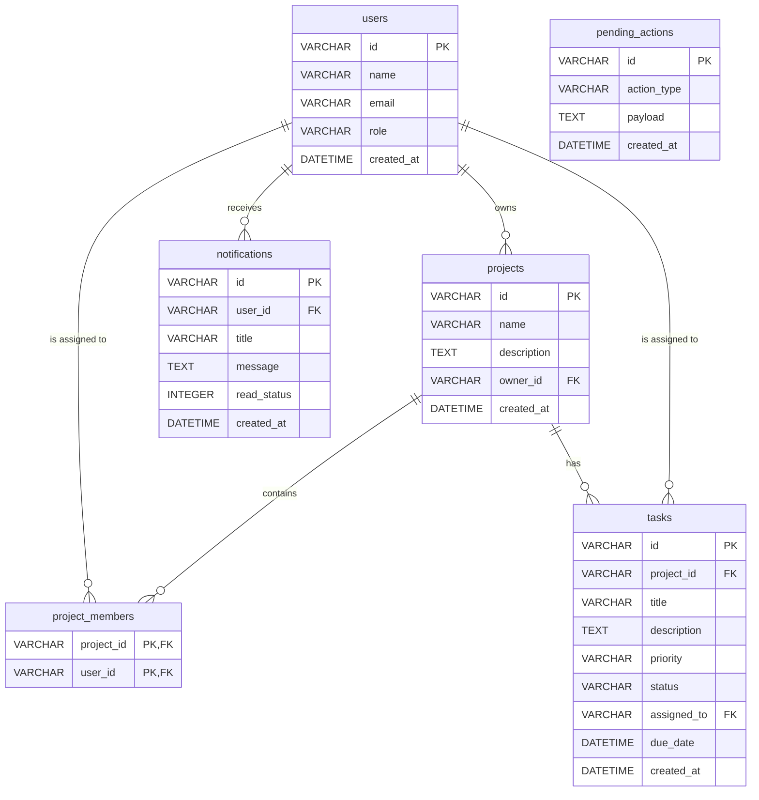

# Entity Relationship Diagram & Database Schema

This document details the database schema, relational structure, and SQLite/MySQL types for the **Smart Task Management** MVP application.

---

## 1. Entity Relationship Diagram (ERD)

The relational schema maps User management, Projects, member assignments, tasks, notifications, and offline sync logs:



---

## 2. Table Specifications

### 2.1 Table: `users`
Stores user profile information and security clearance role.

| Column Name | SQL Type | SQLite Type | Constraints | Description |
|---|---|---|---|---|
| `id` | VARCHAR(50) | TEXT | PRIMARY KEY | Unique user identifier (Firebase UID / Spring UUID) |
| `name` | VARCHAR(100) | TEXT | NOT NULL | Display name |
| `email` | VARCHAR(150) | TEXT | NOT NULL, UNIQUE | User email address |
| `role` | VARCHAR(20) | TEXT | NOT NULL | User privileges: `'Manager'` or `'Member'` |
| `created_at` | DATETIME | TEXT | NOT NULL | User sign up timestamp (ISO 8601) |

---

### 2.2 Table: `projects`
Stores team project details.

| Column Name | SQL Type | SQLite Type | Constraints | Description |
|---|---|---|---|---|
| `id` | VARCHAR(50) | TEXT | PRIMARY KEY | Unique project identifier |
| `name` | VARCHAR(100) | TEXT | NOT NULL | Project name |
| `description` | TEXT | TEXT | NULL | Project details description |
| `owner_id` | VARCHAR(50) | TEXT | FOREIGN KEY -> `users(id)` | Manager user ID owning the project |
| `created_at` | DATETIME | TEXT | NOT NULL | Creation timestamp (ISO 8601) |

---

### 2.3 Table: `project_members`
A join table representing users associated with projects.

| Column Name | SQL Type | SQLite Type | Constraints | Description |
|---|---|---|---|---|
| `project_id` | VARCHAR(50) | TEXT | FK -> `projects(id)`, COMPOSITE PK | Associated project identifier |
| `user_id` | VARCHAR(50) | TEXT | FK -> `users(id)`, COMPOSITE PK | Associated member user identifier |

---

### 2.4 Table: `tasks`
Stores task specifications.

| Column Name | SQL Type | SQLite Type | Constraints | Description |
|---|---|---|---|---|
| `id` | VARCHAR(50) | TEXT | PRIMARY KEY | Unique task identifier |
| `project_id` | VARCHAR(50) | TEXT | FK -> `projects(id)`, NOT NULL | Project parent container |
| `title` | VARCHAR(150) | TEXT | NOT NULL | Task title |
| `description` | TEXT | TEXT | NULL | Task instruction description |
| `priority` | VARCHAR(20) | TEXT | NOT NULL | Priority rating: `'LOW'`, `'MEDIUM'`, `'HIGH'` |
| `status` | VARCHAR(20) | TEXT | NOT NULL | Completion state: `'TODO'`, `'IN_PROGRESS'`, `'DONE'` |
| `assigned_to` | VARCHAR(50) | TEXT | FK -> `users(id)`, NULL | Assigned member user identifier |
| `due_date` | DATETIME | TEXT | NULL | Due date limit timestamp |
| `created_at` | DATETIME | TEXT | NOT NULL | Creation timestamp |

---

### 2.5 Table: `notifications`
Stores target-user push notification alert records.

| Column Name | SQL Type | SQLite Type | Constraints | Description |
|---|---|---|---|---|
| `id` | VARCHAR(50) | TEXT | PRIMARY KEY | Unique notification identifier |
| `user_id` | VARCHAR(50) | TEXT | FK -> `users(id)`, NOT NULL | Target user recipient |
| `title` | VARCHAR(150) | TEXT | NOT NULL | Notification title header |
| `message` | TEXT | TEXT | NOT NULL | Notification message body |
| `read_status` | INT | INTEGER | NOT NULL (Default: `0`) | Read status flag: `0` (Unread), `1` (Read) |
| `created_at` | DATETIME | TEXT | NOT NULL | Date sent |

---

### 2.6 Table: `pending_actions`
A temporary sync queue table capturing offline operations.

| Column Name | SQL Type | SQLite Type | Constraints | Description |
|---|---|---|---|---|
| `id` | VARCHAR(50) | TEXT | PRIMARY KEY | Unique queue ID (generated offline) |
| `action_type` | VARCHAR(50) | TEXT | NOT NULL | Mutation action type: `'CREATE_TASK'`, `'UPDATE_TASK'`, `'DELETE_TASK'`, etc. |
| `payload` | TEXT | TEXT | NOT NULL | JSON string containing data required to make REST request |
| `created_at` | DATETIME | TEXT | NOT NULL | Action log timestamp |

---

## 3. Database Schema Versioning Control

We utilize SQLite `PRAGMA user_version` (or internal `meta` versioning table) to track migration runs.

- **Initial Setup (Version 1):** Creates all 6 tables described above.
- **Migration Handler:** In Dart, our `sqflite` implementation registers:
  ```dart
  db.execute("CREATE TABLE ...");
  ```
  And handles schema modifications incrementally via the `onUpgrade` hook.
