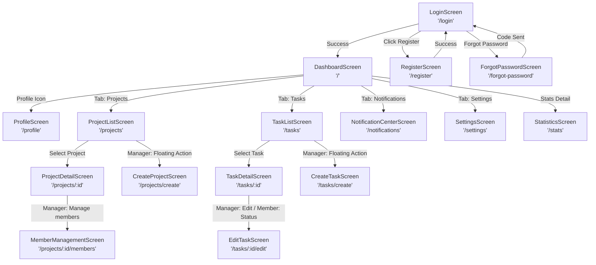

# Use Case Diagram & Screen Flow

This document details the functional Use Cases, Roles, and Screen Flow configurations for the **Smart Task Management** MVP application.

---

## 1. System Actors & Roles

The system supports two primary User Roles with distinct privileges:

1. **Manager (Project Owner):**
   * Can create, edit, and delete projects.
   * Can add/remove members to/from projects.
   * Can create, edit, assign, and delete tasks.
   * Can update task statuses.
2. **Member:**
   * Can view projects they are a member of.
   * Can view tasks assigned to them within projects.
   * Can update task status (To Do → In Progress → Completed).

---

## 2. Use Case Diagram

The relationships between actors and the 16 core screens are defined below:

```mermaid
usecaseDiagram
    actor "User (General)" as user
    actor "Manager" as manager
    actor "Member" as member

    manager --|> user
    member --|> user

    user --> (Login)
    user --> (Register)
    user --> (Reset Password)
    user --> (View Profile)
    user --> (View Dashboard & Stats)
    user --> (View Notifications)
    user --> (Toggle App Settings)

    user --> (View Project List)
    user --> (View Project Details)
    user --> (View Task List)
    user --> (View Task Details)

    manager --> (Create Project)
    manager --> (Manage Members)
    manager --> (Create Task)
    manager --> (Assign & Edit Task)

    member --> (Update Task Status)
```

---

## 3. Screen Flow Map

The navigation flow between the 16 screens is defined using `go_router` paths:



---

## 4. Screen Specifications

### Module 1: Authentication (Member 1)
1. **LoginScreen (`/login`):** Input email & password, remember session checkmark, validation checks, triggers Firebase/API login.
2. **RegisterScreen (`/register`):** Collect Name, Email, Password, Confirm Password, validates fields, creates account.
3. **ForgotPasswordScreen (`/forgot-password`):** Enter email to trigger reset link.
4. **ProfileScreen (`/profile`):** View details (Name, Email, Role: Manager/Member), click sign out to return to `/login`.

### Module 2: Project Management (Member 2)
1. **ProjectListScreen (`/projects`):** Renders project cards. Displays different actions based on User Role (e.g. Floating action button for Manager only).
2. **CreateProjectScreen (`/projects/create`):** Project title & description inputs. Available to Managers only.
3. **ProjectDetailScreen (`/projects/:id`):** Displays description, list of members, and a button to view tasks.
4. **MemberManagementScreen (`/projects/:id/members`):** Manager adds members via email lookup or deletes associated members.

### Module 3: Task Management (Member 3)
1. **TaskListScreen (`/tasks`):** Lists all tasks inside the selected project or global tasks. Includes status filters (To Do, In Progress, Completed) and search input.
2. **CreateTaskScreen (`/tasks/create`):** Form for title, description, assigned member dropdown, priority level selection, due date selector.
3. **TaskDetailScreen (`/tasks/:id`):** Details displaying priorities, deadlines, assignees, and progress status.
4. **EditTaskScreen (`/tasks/:id/edit`):** Manager updates descriptions, priorities, due dates. Members can only update the progress status dropdown.

### Module 4: Dashboard & Charts (Member 4)
1. **DashboardScreen (`/`):** Summary counts (Total Projects, Total Tasks, Completed Tasks). Quick task indicators.
2. **StatisticsScreen (`/stats`):** Visual chart representations (Pie Chart of task status distribution).
3. **NotificationCenterScreen (`/notifications`):** List of notification messages received (e.g., Task Assigned, Project Invites).
4. **SettingsScreen (`/settings`):** PERSISTED theme selection (Dark Mode toggle), notification push toggles.
