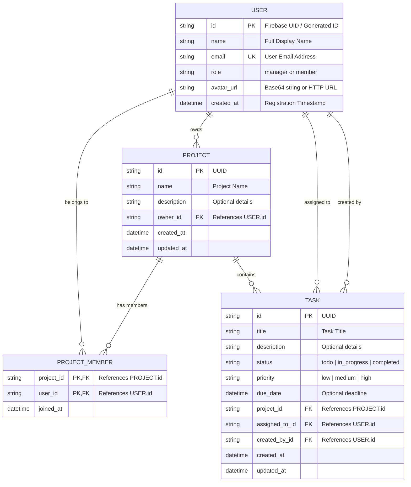

# SOFTWARE REQUIREMENT SPECIFICATION (SRS)
## Project Name: SMART TASK SYSTEM (PRM393 - Group 5)

**Hanoi, Jan 2026**

---

## Table of Contents
* [I. Record of Changes](#i-record-of-changes)
* [II. Software Requirement Specification](#ii-software-requirement-specification)
  * [1. Overall Requirements](#1-overall-requirements)
    * [1.1 User Requirements & Actors](#11-user-requirements--actors)
    * [1.2 Use Cases (UC) List](#12-use-cases-uc-list)
    * [1.3 Use Case Diagrams](#13-use-case-diagrams)
    * [1.4 Entity Relationship Diagram (ERD)](#14-entity-relationship-diagram-erd)
  * [2. Use Case Specifications](#2-use-cases-specifications)
    * [2.1 UC-01: Login System](#21-uc-01-login-system)
    * [2.2 UC-02: Forgot Password Recovery](#22-uc-02-forgot-password-recovery)
    * [2.3 UC-03: Update Profile & Change Password](#23-uc-03-update-profile--change-password)
    * [2.4 UC-04: View Dashboard & Charts Statistics](#24-uc-04-view-dashboard--charts-statistics)
    * [2.5 UC-05: Create & Assign Tasks](#25-uc-05-create--assign-tasks)
  * [3. Functional Requirements](#3-functional-requirements)
    * [3.1 Authentication & Profile Module](#31-authentication--profile-module)
    * [3.2 Project & Task Management Module](#32-project--task-management-module)
    * [3.3 Analytics & Charts Module](#33-analytics--charts-module)
  * [4. Non-Functional Requirements](#4-non-functional-requirements)
    * [4.1 External Interfaces](#41-external-interfaces)
    * [4.2 Quality Attributes](#42-quality-attributes)
  * [5. Requirement Appendix](#5-requirement-appendix)
    * [5.1 Business Rules (BR)](#51-business-rules-br)
    * [5.2 System Messages (MSG)](#52-system-messages-msg)

---

## I. Record of Changes

| Date | Version | Description | Author |
| :--- | :--- | :--- | :--- |
| 2026-07-15 | 1.0.0 | Initial version with basic authentication and local SQLite sync. | Group 5 |
| 2026-07-18 | 1.1.0 | Added NestJS Backend REST APIs integration and statistics charts module. | Group 5 |
| 2026-07-19 | 1.2.0 | Redesigned Profile Screen, added image picker (Base64), theme toggle switch, secure password reauthentication, and Google Docs template formatting. | Group 5 |

---

## II. Software Requirement Specification

## 1. Overall Requirements

### 1.1 User Requirements & Actors
Tác nhân (Actors) là những thực thể bên ngoài tương tác trực tiếp với hệ thống Smart Task. Hệ thống bao gồm 2 nhóm người dùng chính tương ứng với 2 Actors sau:

| # | Actor | Description (Mô tả vai trò) |
| :--- | :--- | :--- |
| 1 | **Manager** | Trưởng nhóm/Quản lý dự án. Có quyền tạo dự án mới, quản lý thành viên, tạo công việc (Tasks), phân công công việc cho thành viên, và theo dõi toàn bộ tiến độ thông qua biểu đồ phân tích (Dashboard Statistics). |
| 2 | **Member** | Thành viên tham gia dự án. Có quyền xem danh sách dự án mình được tham gia, danh sách công việc được giao, cập nhật tiến độ công việc (Trạng thái Todo, In Progress, Completed), chỉnh sửa hồ sơ cá nhân và thay đổi giao diện. |

---

### 1.2 Use Cases (UC) List

| ID | Use Case Name | Feature Module | Use Case Description |
| :--- | :--- | :--- | :--- |
| **UC-01** | Đăng nhập hệ thống (Login) | Authentication | Xác thực người dùng bằng tài khoản email & mật khẩu thông qua Firebase Auth hoặc cơ chế Mock Fallback. |
| **UC-02** | Quên mật khẩu (Forgot Password) | Authentication | Người dùng nhập Email để hệ thống gửi liên kết đặt lại mật khẩu (Password Reset Link) qua hòm thư điện tử. |
| **UC-03** | Chỉnh sửa hồ sơ cá nhân (Update Profile) | Profile | Cho phép xem/chỉnh sửa Tên hiển thị, thay đổi ảnh đại diện (chọn trực tiếp từ máy ảnh/bộ sưu tập thiết bị chuyển sang Base64), đổi mật khẩu yêu cầu xác thực mật khẩu cũ. |
| **UC-04** | Chuyển đổi giao diện sáng tối (Toggle Theme) | Settings | Bật/tắt chế độ sáng hoặc tối bằng nút gạt Custom (ThemeToggleSwitch) dạng mini trên thanh AppBar. |
| **UC-05** | Quản lý dự án (Manage Projects) | Project | Tạo mới dự án, mô tả dự án, xem danh sách dự án. (Chỉ áp dụng với Manager). |
| **UC-06** | Quản lý thành viên (Manage Members) | Project | Thêm/Xóa thành viên tham gia vào dự án dựa trên Email. (Chỉ áp dụng với Manager). |
| **UC-07** | Quản lý công việc (Manage Tasks) | Task | Tạo mới công việc, thiết lập mức độ ưu tiên, ngày hết hạn, phân công người thực hiện. (Chỉ áp dụng với Manager). |
| **UC-08** | Cập nhật trạng thái công việc (Update Task Status) | Task | Thay đổi trạng thái tiến độ thực hiện của công việc (Todo, In Progress, Completed). (Chung cho Manager & Member). |
| **UC-09** | Xem biểu đồ thống kê (View Statistics) | Analytics | Theo dõi số lượng công việc theo trạng thái, mức độ ưu tiên và hiệu suất hoàn thành dưới dạng biểu đồ tròn (Pie) và cột (Bar). (Chỉ áp dụng với Manager). |

---

### 1.3 Use Case Diagrams

Dưới đây là sơ đồ Use Case biểu diễn tương tác giữa các tác nhân và chức năng hệ thống:

```mermaid
usecaseDiagram
    actor Manager
    actor Member
    
    %% Common Use Cases
    Manager --> (UC-01: Login)
    Manager --> (UC-02: Forgot Password)
    Manager --> (UC-03: Update Profile)
    Manager --> (UC-04: Toggle Theme)
    Manager --> (UC-08: Update Task Status)

    Member --> (UC-01: Login)
    Member --> (UC-02: Forgot Password)
    Member --> (UC-03: Update Profile)
    Member --> (UC-04: Toggle Theme)
    Member --> (UC-08: Update Task Status)

    %% Manager Only Use Cases
    Manager --> (UC-05: Manage Projects)
    Manager --> (UC-06: Manage Members)
    Manager --> (UC-07: Manage Tasks)
    Manager --> (UC-09: View Statistics)
```

---

### 1.4 Entity Relationship Diagram (ERD)

Mô hình thực thể liên kết (ERD) của hệ thống được tổ chức tối ưu, lưu trữ đồng bộ trên PostgreSQL (Supabase Cloud) và cache cục bộ ngoại tuyến bằng SQLite (Mobile/Web Client):



#### Entities Description
* **USER**: Lưu giữ thông tin tài khoản người dùng, phân biệt quyền bằng trường `role`.
* **PROJECT**: Các dự án do Manager tạo ra để quản lý nhóm công việc.
* **PROJECT_MEMBER**: Bảng liên kết trung gian biểu diễn quan hệ nhiều-nhiều (N-N), thể hiện danh sách dự án mà các Member được tham gia.
* **TASK**: Lưu trữ các công việc chi tiết nằm trong dự án, liên kết tới người tạo (Manager) và người thực hiện (Member).

---

## 2. Use Case Specifications

### 2.1 UC-01: Login System
* **Primary Actors**: Manager, Member.
* **Secondary Actors**: Firebase Auth API.
* **Description**: Người dùng đăng nhập vào hệ thống để truy cập vào các chức năng được phân quyền phù hợp với vai trò của mình.
* **Preconditions**: Tài khoản của người dùng đã được tạo và kích hoạt trên hệ thống.
* **Postconditions**: Người dùng đăng nhập thành công, token được lưu vào bộ nhớ cục bộ (`SharedPreferences`), dữ liệu được đồng bộ về SQLite cache.
* **Normal Flow**:
  1. Người dùng mở ứng dụng và truy cập màn hình Đăng nhập (Login Screen).
  2. Người dùng nhập Email và Mật khẩu.
  3. Người dùng nhấn nút **Login**.
  4. Hệ thống gửi thông tin xác thực đến Firebase Auth SDK (hoặc Local Mock Mode nếu chạy ngoại tuyến).
  5. Hệ thống xác thực thành công, lưu Token truy cập.
  6. Hệ thống điều hướng người dùng tới màn hình tương ứng: **Manager Dashboard** (nếu role = manager) hoặc **Member Tasks** (nếu role = member).
* **Alternative Flows**:
  * **Trường hợp mất kết nối**: Nếu client không thể kết nối tới server, hệ thống sẽ thực hiện đăng nhập ngoại tuyến bằng cách đối chiếu thông tin mã hóa với dữ liệu đã lưu trong cơ sở dữ liệu SQLite cục bộ.

---

### 2.2 UC-02: Forgot Password Recovery
* **Primary Actors**: Manager, Member.
* **Secondary Actors**: Firebase Auth Email Service.
* **Description**: Cho phép người dùng khôi phục lại mật khẩu khi quên bằng cách nhận link đặt lại mật khẩu trực tiếp qua Email.
* **Preconditions**: Tài khoản email đã tồn tại trên hệ thống.
* **Postconditions**: Một email chứa liên kết đặt lại mật khẩu (Password Reset Link) được gửi đến hòm thư của người dùng.
* **Normal Flow**:
  1. Người dùng bấm chọn **Forgot Password** tại màn hình Đăng nhập.
  2. Hệ thống hiển thị form nhập duy nhất 1 trường Email.
  3. Người dùng nhập Email và nhấn nút **Send Reset Link**.
  4. Hệ thống gửi yêu cầu khôi phục tới Firebase Auth Cloud.
  5. Hệ thống gửi email thành công và hiển thị thông báo yêu cầu người dùng kiểm tra hòm thư.
  6. Người dùng nhấn vào link trong email để thiết lập mật khẩu mới trực tiếp trên trình duyệt hoặc chuyển tiếp ứng dụng.

---

### 2.3 UC-03: Update Profile & Change Password
* **Primary Actors**: Manager, Member.
* **Secondary Actors**: NestJS Backend API, Firebase Auth SDK.
* **Description**: Cho phép người dùng đổi tên hiển thị, thay ảnh đại diện từ thiết bị và cập nhật mật khẩu mới yêu cầu bảo mật xác nhận mật khẩu cũ.
* **Preconditions**: Người dùng đã đăng nhập thành công.
* **Postconditions**: Dữ liệu hồ sơ mới được cập nhật lên Postgres DB (qua NestJS) và đồng bộ cục bộ SQLite, mật khẩu được đổi thành công trên Firebase Auth.
* **Normal Flow**:
  1. Người dùng mở màn hình **Profile Screen** (Mặc định ở trạng thái Read-only).
  2. Người dùng nhấn nút **Edit Profile** ở cuối màn hình.
  3. Form chuyển sang trạng thái cho phép chỉnh sửa:
     * Chạm vào Avatar hiển thị trình chọn ảnh của thiết bị (`image_picker`), ảnh sau khi chọn được chuyển thành chuỗi Base64.
     * Nhập tên hiển thị mới tại trường **Full Name**.
     * Nhập **Current Password** (Mật khẩu hiện tại) và **New Password** (Mật khẩu mới) nếu muốn đổi mật khẩu.
  4. Người dùng nhấn nút **Save Changes**.
  5. Hệ thống thực hiện:
     * Nếu có đổi mật khẩu: Gọi Firebase Auth `reauthenticateWithCredential` bằng mật khẩu cũ. Nếu mật khẩu cũ chính xác, gọi tiếp `updatePassword` với mật khẩu mới.
     * Gửi yêu cầu cập nhật Name & Base64 Avatar lên API NestJS `PUT /users/profile`.
  6. Hệ thống thông báo thành công, cập nhật cache SQLite local, chuyển form về chế độ Read-only.
* **Alternative Flows**:
  * **Trường hợp nhập sai mật khẩu cũ**: Firebase Auth trả về lỗi `invalid-credential` (MSG-02), hệ thống hủy bỏ quá trình cập nhật, hiển thị cảnh báo đỏ và giữ nguyên dữ liệu trên form để người dùng sửa lại.
  * **Không đổi mật khẩu**: Nếu để trống 2 trường mật khẩu cũ và mới, hệ thống tự động bỏ qua kiểm tra mật khẩu và chỉ thực hiện cập nhật Tên/Ảnh đại diện bình thường.

---

### 2.4 UC-04: View Dashboard & Charts Statistics
* **Primary Actors**: Manager.
* **Secondary Actors**: NestJS Backend API.
* **Description**: Giúp Manager theo dõi trực quan số liệu, tỷ lệ hoàn thành công việc của tất cả các dự án thông qua hệ thống biểu đồ.
* **Preconditions**: Người dùng đăng nhập với quyền hạn Manager.
* **Normal Flow**:
  1. Manager đăng nhập và hệ thống điều hướng trực tiếp vào màn hình **Manager Dashboard**.
  2. Hệ thống gọi API `/statistics/dashboard` lên NestJS để tải dữ liệu thống kê thật.
  3. Màn hình render các thành phần biểu đồ động:
     * **Completion Rate Card**: Hiển thị phần trăm hoàn thành tổng thể dự án trên nền Gradient.
     * **Task Status (Pie Chart)**: Biểu đồ tròn thể hiện phân phối công việc theo trạng thái (Todo, In Progress, Completed).
     * **Priority Distribution (Bar Chart)**: Biểu đồ cột phân loại công việc theo độ ưu tiên (Low, Medium, High).
     * **Project Breakdown List**: Danh sách tiến độ chi tiết của từng dự án dạng thanh Progress Bar.

---

### 2.5 UC-05: Create & Assign Tasks
* **Primary Actors**: Manager.
* **Secondary Actors**: NestJS Backend API.
* **Description**: Manager tạo công việc mới trong dự án và gán cho các thành viên thực hiện.
* **Preconditions**: Dự án đã được tạo và có thành viên tham gia.
* **Normal Flow**:
  1. Manager truy cập vào chi tiết dự án, nhấn nút **Add Task**.
  2. Nhập Tiêu đề, Mô tả công việc, chọn Mức độ ưu tiên (Low, Medium, High), chọn Ngày hết hạn (Due Date) và chọn Thành viên thực hiện từ danh sách thành viên dự án.
  3. Nhấn **Create Task**.
  4. Hệ thống gửi yêu cầu lưu trữ lên NestJS Backend, đẩy thông tin công việc mới xuống Database.
  5. Hệ thống tự động cập nhật lại danh sách công việc trên màn hình dự án.

---

## 3. Functional Requirements

### 3.1 Authentication & Profile Module
* **FR-01.1**: Hệ thống phải hỗ trợ xác thực đăng nhập qua Firebase Auth SDK (sử dụng Token JWT).
* **FR-01.2**: Trong điều kiện thử nghiệm cục bộ/Mock mode, hệ thống phải cho phép giải mã thủ công payload JWT token để lấy Email/UID thật nhằm kết nối đúng với dữ liệu PostgreSQL.
* **FR-01.3**: Hệ thống phải cung cấp form nhập Email tối giản gửi link khôi phục mật khẩu trực tiếp tới người dùng.
* **FR-01.4**: Cho phép người dùng chuyển đổi chế độ giao diện sáng/tối (Dark/Light Mode) thông qua nút gạt Custom dạng trượt có kích thước tối giản (chiều rộng 72) ở góc phải AppBar.
* **FR-01.5**: Cho phép người dùng thay đổi ảnh đại diện bằng cách kích hoạt camera hoặc thư viện thiết bị, tự động nén và chuyển hóa ảnh sang định dạng Base64 String dài lưu trữ trực tiếp vào Database.

### 3.2 Project & Task Management Module
* **FR-02.1**: Cho phép Manager tạo, sửa, xóa dự án và thêm/xóa thành viên vào dự án thông qua Email.
* **FR-02.2**: Cho phép Manager tạo công việc, chỉnh sửa tiêu đề, phân công người làm và đặt mức độ ưu tiên.
* **FR-02.3**: Cho phép Member thay đổi trạng thái tiến độ thực hiện của công việc được giao (Todo ➔ In Progress ➔ Completed).
* **FR-02.4**: Hệ thống phải tự động đồng bộ dữ liệu dự án/công việc từ SQLite cục bộ lên Postgres DB khi có kết nối mạng và ngược lại.

### 3.3 Analytics & Charts Module
* **FR-03.1**: Hệ thống phải hiển thị biểu đồ tròn biểu diễn tỷ lệ trạng thái công việc (Todo, In Progress, Completed) sử dụng thư viện `fl_chart`.
* **FR-03.2**: Hệ thống phải hiển thị biểu đồ cột biểu diễn phân phối độ ưu tiên công việc (Low, Medium, High).
* **FR-03.3**: Các số liệu trên biểu đồ phải được liên kết động với dữ liệu thực tế tải về từ API NestJS `/statistics`.

---

## 4. Non-Functional Requirements

### 4.1 External Interfaces
* **User Interface**: 
  * Ứng dụng di động và web được xây dựng bằng **Flutter SDK**, sử dụng thiết kế Material Design 3 hiện đại, linh hoạt tương thích trên Google Chrome và các thiết bị Android/iOS.
  * Hỗ trợ thiết kế responsive đa nền tảng, tự động co giãn các phần tử UI.
* **Software Interfaces**:
  * **Backend Framework**: NestJS kết hợp Prisma ORM.
  * **Database**: PostgreSQL (Supabase Cloud) và SQLite local cache (sử dụng `sqflite`/`sqlite3` WASM trên môi trường Web).
  * **Authentication Provider**: Firebase Authentication.

### 4.2 Quality Attributes
* **Bảo mật (Security)**:
  * Mọi API tương tác với Backend phải được bảo vệ bởi lớp kiểm soát `AuthGuard`, xác thực JWT Bearer Token.
  * Việc đổi mật khẩu yêu cầu xác thực lại thông qua Firebase Auth nhằm ngăn chặn rủi ro chiếm đoạt phiên đăng nhập.
* **Khả năng hoạt động offline (Offline Availability)**:
  * Ứng dụng phải lưu trữ dữ liệu cache ngoại tuyến bằng SQLite. Khi không có kết nối internet, người dùng vẫn có thể xem thông tin cá nhân, dự án, công việc và cập nhật cục bộ. Hệ thống sẽ lưu các thay đổi này dưới dạng `PendingAction` và đồng bộ tự động lên Postgres DB ngay khi thiết bị trực tuyến trở lại.
* **Hiệu năng (Performance)**:
  * Thời gian phản hồi của các biểu đồ dashboard thống kê và danh sách công việc phải dưới **1.5 giây** trong điều kiện mạng ổn định.

---

## 5. Requirement Appendix

### 5.1 Business Rules (BR)

* **BR-01 (Phân quyền quản lý)**: Chỉ có người dùng có vai trò `role = manager` mới được thực hiện các thao tác: Tạo dự án, Xóa dự án, Thêm/Xóa thành viên dự án, Tạo/Phân công công việc (Task).
* **BR-02 (Cập nhật trạng thái công việc)**: Member chỉ được cập nhật trạng thái tiến độ (`status`) đối với các công việc được chỉ định trực tiếp cho họ (`assignedToId = userId`).
* **BR-03 (Ràng buộc mật khẩu)**: Mật khẩu mới thiết lập phải có độ dài tối thiểu **6 ký tự**.
* **BR-04 (Yêu cầu mật khẩu cũ)**: Khi tiến hành đổi mật khẩu mới trong màn hình Profile, người dùng bắt buộc phải nhập Mật khẩu hiện tại (Current Password) chính xác, ngoại trừ trường hợp người dùng khôi phục mật khẩu thông qua email gửi link của Firebase Auth.
* **BR-05 (Lưu trữ ảnh đại diện)**: Ảnh đại diện được chọn từ thiết bị sẽ được mã hóa Base64 và lưu trữ dưới dạng chuỗi văn bản (`TEXT` trong Postgres/SQLite). Kích thước ảnh tối đa cho phép tải lên là **512x512 pixels** với chất lượng nén **80%** để tối ưu hóa băng thông truyền tải.

### 5.2 System Messages (MSG)

* **MSG-01 (Lỗi kết nối máy chủ)**:
  * *Nội dung hiển thị*: "Cannot connect to backend server. Please verify that your local NestJS server is running on http://localhost:5000"
  * *Trường hợp áp dụng*: Khi Client không thể kết nối tới cổng dịch vụ của backend NestJS (Lỗi mạng hoặc server local chưa khởi động).
* **MSG-02 (Lỗi sai mật khẩu cũ)**:
  * *Nội dung hiển thị*: "[firebase_auth/invalid-credential] The supplied auth credential is incorrect, malformed or has expired."
  * *Trường hợp áp dụng*: Khi người dùng tiến hành cập nhật mật khẩu mới nhưng nhập sai mật khẩu hiện tại trong form Profile.
* **MSG-03 (Lỗi không tìm thấy hồ sơ)**:
  * *Nội dung hiển thị*: "User profile not found in database." (HTTP 401).
  * *Trường hợp áp dụng*: Khi tài khoản được tạo trên Firebase Auth nhưng dữ liệu hồ sơ tương ứng trong cơ sở dữ liệu Postgres chưa được khởi tạo hoặc bị lệch pha ID.
* **MSG-04 (Lỗi định dạng dữ liệu)**:
  * *Nội dung hiển thị*: "Bad Request: validation failed." (HTTP 400).
  * *Trường hợp áp dụng*: Khi dữ liệu truyền lên không khớp với quy chuẩn cấu trúc DTO ở backend (ví dụ: Tên hiển thị ngắn hơn 3 ký tự).
